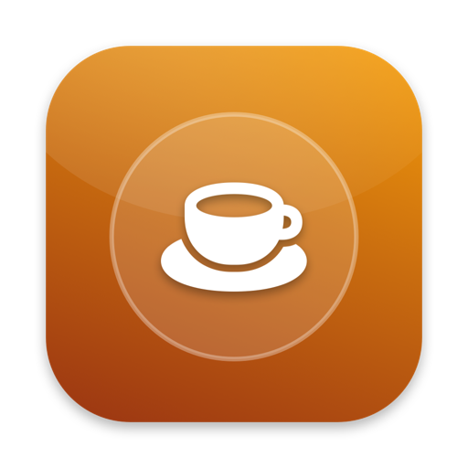
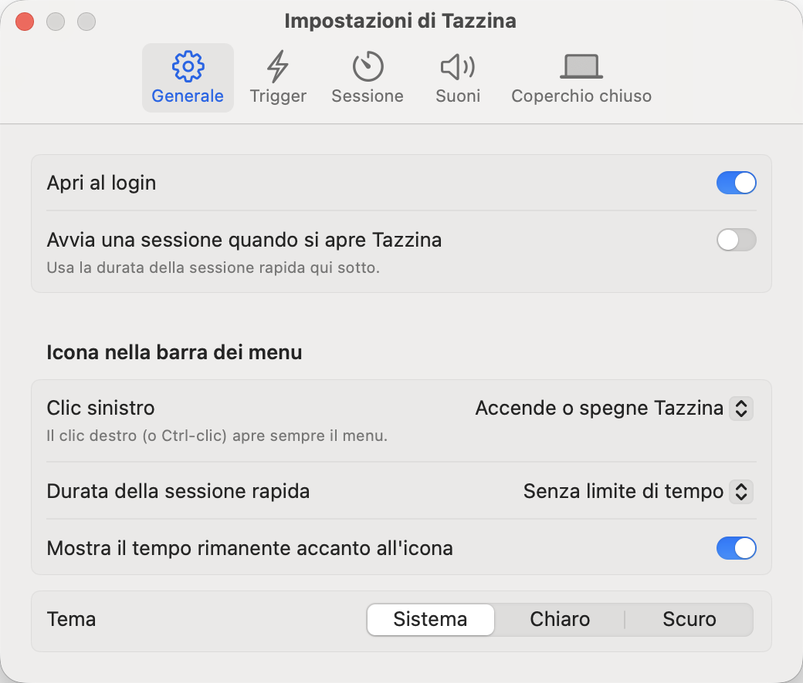

# Tazzina ☕️


**Tazzina** is a native macOS menu bar app that keeps your Mac awake: for as long as you want, until a set time, while an app is open, or automatically whenever your own triggers say so.

<p align="center"></p>



## ✨ Features
- **One click:** left click on the cup turns Tazzina on or off; right click (or Control-click) opens the menu. Left click can also be set to open the menu.
- **Sessions:** indefinitely, for 5 minutes to 12 hours, until a time of your choice, or while an app is running. Extend a timed session from the menu.
- **Triggers:** start a session automatically while all the conditions of a rule are true, and end it when they stop: app running or in front, Wi-Fi network, external display, power adapter, battery level, time of day and weekdays, USB or Bluetooth device, connected drive. A session you start yourself always comes first; turning off a trigger session pauses that trigger until its conditions change.
- **Sounds:** a sound when Tazzina turns on and when it turns off (also for triggers, optional), with your choice of macOS sounds and volume.
- **Closed lid:** keep a MacBook running with the lid closed through a small system service approved once in System Settings. Sleep goes back to normal when the session ends or Tazzina quits, even after a crash.
- **Safety:** end the session when the battery is low or the power adapter is disconnected.
- **Display:** let the screen sleep while the Mac stays awake, per session or by default.
- **Remaining time** next to the menu bar icon, and notifications when a session ends on its own.
- **Automation:** `tazzina://on`, `tazzina://on?minutes=30`, `tazzina://on?app=com.apple.Safari`, `tazzina://off`, `tazzina://toggle` (from Terminal: `open "tazzina://toggle"`, or from Shortcuts with "Open URL").
- **Lightweight:** reacts to system events instead of polling every second.
- **Appearance:** System, Light and Dark themes.
- **Multi-language:** Italian 🇮🇹 and English 🇬🇧, following the system or chosen in Settings.

## 🚀 Requirements
- macOS 14 Sonoma or later (Apple Silicon or Intel)

## 🍺 Installation via Homebrew
```bash
brew install --cask gionnio/tap/tazzina
```

## 📥 Manual Installation
1. Download `Tazzina_vX.Y.Z.zip` from the Releases page and unzip it.
2. Move **Tazzina.app** to the Applications folder.

### ⚠️ How to open the app
Tazzina is not signed with an Apple Developer ID, so macOS blocks it the first time:

1. Open `Tazzina` once and close the warning.
2. Go to **System Settings → Privacy & Security**, scroll down and click **Open Anyway** next to the Tazzina message.
3. Confirm with **Open**.

*Right-click → Open no longer works on macOS 15 (Sequoia) and later. You only need to do this once.*

Wi-Fi triggers need **Location** permission (macOS only reveals the network name to apps allowed to use Location). Closed-lid mode needs the system service to be allowed in **System Settings › General › Login Items & Extensions**.

## 🛠 Build from Source
Requires the Xcode Command Line Tools (Swift 5.9+).

```bash
git clone https://github.com/Gionnio/tazzina.git
cd tazzina
./build_app.sh            # creates build/Tazzina.app
./build_app.sh --install  # also installs it in /Applications and opens it
```

## 🚧 Roadmap & TODO
- [x] Sessions, sounds, left click toggle
- [x] Triggers
- [x] Closed-lid mode
- [ ] Global keyboard shortcut
- [ ] More trigger conditions (audio playing, user idle, IP address / VPN)
- [ ] Alarm when the lid is closed on battery during a session
- [ ] Session statistics
- [x] Homebrew cask

## Privacy & Security
- Tazzina works entirely on your Mac: no network connections, no analytics.
- The closed-lid system service runs as root only to switch `pmset disablesleep` on and off, and only accepts requests from Tazzina.
- Location is used only to read the Wi-Fi network name for Wi-Fi triggers; it is never stored or sent anywhere.

## 🤖 AI Acknowledgment
This application was developed with the assistance of Artificial Intelligence. The idea, the requirements and the testing are mine; the code was written with the help of AI tools.

---

Created with AI, ❤️ and SwiftUI.
